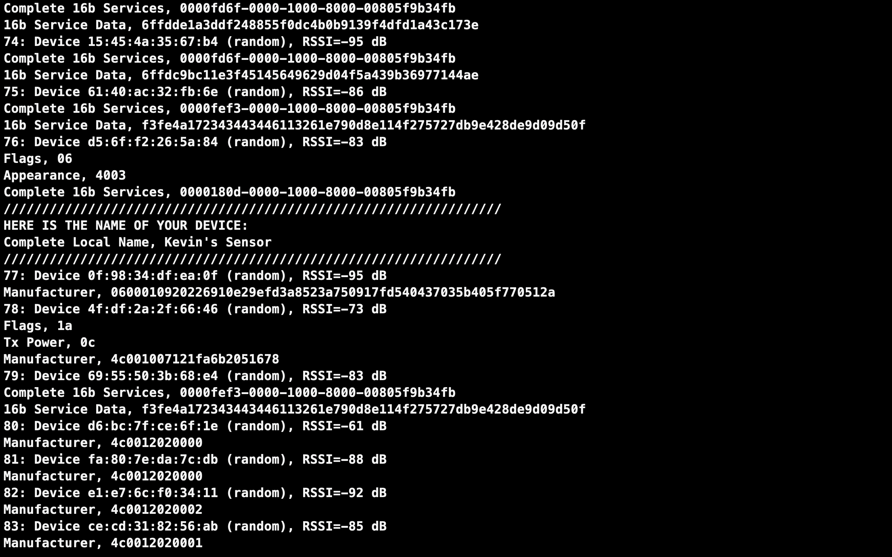
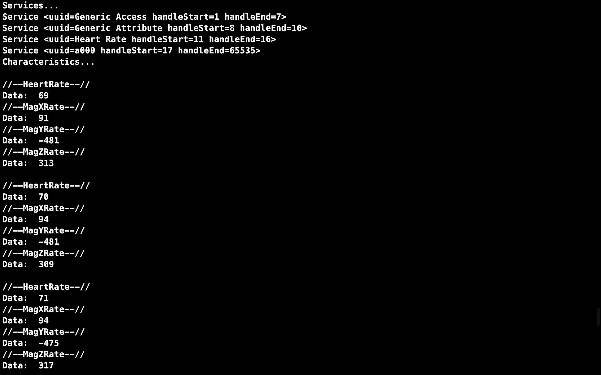

# hw4_BLE

## How to Run Code

### On Mbed Program

* `git clone https://github.com/ARMmbed/mbed-os-example-ble`
* `cd mbed-os-example-ble`
* New an mbed studio project, delete the `main.cpp`
* Copy the files under the directory `BLE_GattServer_AddService` to the new project
* Replace `mbed_app.json` with `./server/mbed_app.json`
* Replace `source/main.cpp` with `./server/main.cpp`
* Put the file `./server/MagnetoService.h` into `mbed-os/connectivity/FEATURE_BLE/include/ble/services/`
* Put the directory `./server/mbed files/BSP_B-L475E-IOT01` into the project
* Compile and run

### On RPi

Copy the file `client/ble_client.py` to RPi and run `sudo python ble_client.py`

## Results

### Find the peripheral in mbed-os (stm32) successfully

### Print the simulated heart rate values and the 3D values of magnetometer sensor

